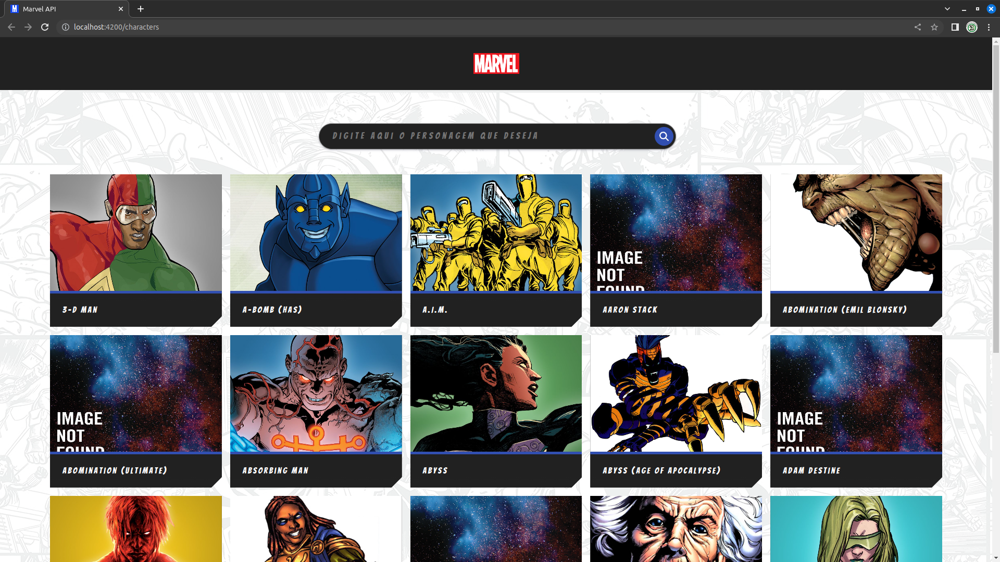
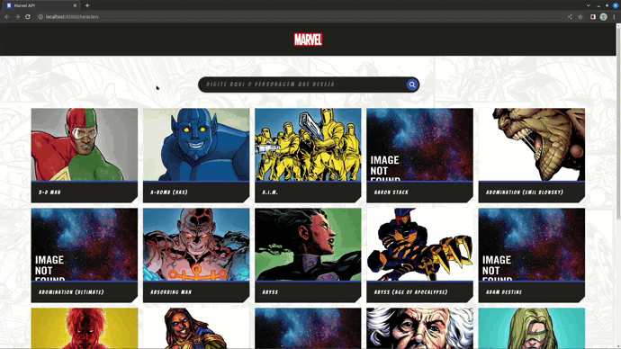
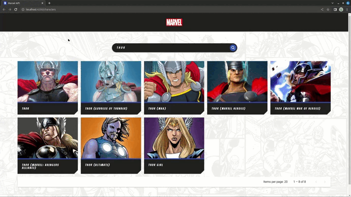

# Projeto Marvel API

![image]width="1000px"(https://upload.wikimedia.org/wikipedia/commons/thumb/b/b9/Marvel_Logo.svg/2560px-Marvel_Logo.svg.png)

# Funcionalidades

### Lista de Personagens

A aplicação inicia na lista de personagens, com design baseado em cards, que renderizam nome e imagem do personagem provindas da API oficial da Marvel.

### Busca de personagem por nome

No topo da página, há uma barra de pesquisa onde pode ser buscado um personagem pelo nome, utilizando um parâmeto da API.

### Modal contendo detalhes do personagem

Ao clicar em um card, um modal contendo nome, imagem, descrição e quadrinhos nos quais o personagem aparece renderiza na tela do usuário. Modal foi feito utilizando a biblioteca de UI do próprio Angular, o Angular Material. 

Ao clicar no "MORE" o usuario sera redirecionado ao site da marvel apresentando mais quadrinhos referente ao personagem buscado.

# Tecnologias utilizadas para o desenvolvimento do projeto

# Princípios de Engenharia de Software 

Neste projeto, utilizei o princípio de SRP - (Single Responsibility Principle), buscando dar a cada component do angular uma unica responsabilidade, facilitando o uso e deixando o codigo organizado.

# Porque você optou pela tecnologia X e não a Y

Optei por fazer o projeto em Angular, pois foi a minha primeira framework aprendida junto ao Field Academy e tambem pela propria Field Control ja fazer uso dela.

# Desafios encontrados e como foi resolvido 

Primeiramente iniciei o projeto logo no comeco dos estudos com angular. Com isso, obtive alguma dificuldade com os components, porem com bastante pratica e dedicacao consegui ultrapassar essa barreira e comecei a organizar os components. Logo depois tive dificuldade na parte da conexao com a api da marvel, pois ela exige o dev a utilizar uma hash MD5 para acessar os dados e apos algumas pesquisas e leitura da documentacao da api, consegui fazer, tambem nao foi preciso fazer requisicao a api por ID ,pois no json inicial ja vem todas as informacoes, quanto menos requisicao a api, melhor. Alem disso o modal para apresentar os detalhes dos personagens, utilizado com o proprio UI do Angular Material foi outra dificuldade pois ainda estou em fase de aprendizado, porem consegui fazer com base no curso de angular da Udemy e bastante pesquisas por fora. Ja os testes foram bem complexos pra mim, mas consegui implementar da melhor maneira possivel com o Jasmine do angular.
Enfrentei varios desafios ao fazer o projeto, porem com o impulso dado no Field Academy, com dedicacao e pondo bastante a mao na massa eu consegui vencer mais essa barreira e estou muito feliz comigo mesmo e sei que sou capaz de resolver os problemas. 

# O que poder ser melhorado e como fazer 

Com base nos meus estudos, vi que com o angular e possivel fazer muitas coisas a mais no projeto, porem dedici fazer algo mais simples, mas que tenha tudo que e pedido no desafio da melhor maneira possivel, com um codigo organizado.
Futuramente pretendo fazer uma paginacao, colocando uma pagina inicial separando melhor os personagens e as informacoes por pagina, melhorar a questao da responsividade e adicionar algumas features novas. Tambem utilizar esse projeto como base para consumir outras API's para fazer projetos diferentes.

# Sobre mim 

Meu nome e Victor Job, tenho 22 anos, atualmente estou no ultimo ano do curso de engenharia da computacao na faculdade UNILAGO. Desde crianca, sempre amei a tecnologia, com 10 anos, sobre ifluencia do meu pai, eu ja mexia com as pecas dos meus computadores, sempre que tinha algum problema eu tentava resolver e as formatacoes era sempre eu que fazia e pelo que eu me lembro nunca levei um computador para uma loja de informatica, era sempre eu que colocava a mao na massa kkk.
Ao entrar na faculdade eu comecei a conhecer um mundo novo de possibilidades com a programacao, mas como eu trabalhei como tecnico de informatica no meu segundo e terceiro ano, nao consegui progredir muito com meus estudos na area de desenvolvimento, porem no meu ultimo semestre tive mais contato com a programacao na faculdade e fui gostando ainda mais da area, com isso tive a que tomar a dificil decisao de parar de trabalhar como tecnico pra focar meus estudos na programacao que e o meu sonho. Depois disso veio o Field Academy que foi um divisor de aguas na minha vida, tanto profissional, como pessoal e que agregou muito no meus estudos e me proporcionou ter a capacidade de fazer este projeto, e claro mesmo apos o termino do treinamento estou sempre estudando e evoluindo cada dia mais e me desafiando a buscar o melhor possivel.

# Contatos

<ul>
  <li>E-mail: victorsimon553@gmail.com</li>
  <li>Linkedin: https://www.linkedin.com/in/victor-job-2017b01ab/</li>
</ul>
